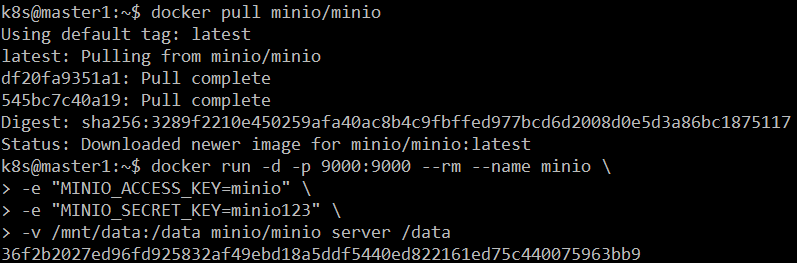

# Velero 설치 가이드

> Velero 설치 yaml 파일은 velero binary에 포함되어 있습니다.

## 목차

- [폐쇄망 설치 가이드](#폐쇄망-설치-가이드)
- [일반 설치 가이드](#설치-가이드)
- [삭제 가이드](#삭제-가이드)

## 구성 요소 및 버전

### Default velero 버전

- [v1.4.2](https://github.com/vmware-tanzu/velero/releases/tag/v1.4.2)

### 도커 이미지 버전

- [velero/velero:v1.4.2](https://hub.docker.com/layers/velero/velero/v1.4.2/images/sha256-a9fa79afd80cfc5e2328b32240d822431377590e0ae334cc057157f652ee2355?context=explore)
- [velero/velero-plugin-for-aws:v1.1.0](https://hub.docker.com/layers/velero/velero-plugin-for-aws/v1.1.0/images/sha256-e52d3545c3c52dbd061f0bf2ae8f7d6b21747d0a8bc64245fb58c8de54df9b33?context=explore)
- [velero/velero-restic-restore-helper:v1.4.2](https://hub.docker.com/layers/velero/velero-restic-restore-helper/v1.4.2/images/sha256-cf0c04f02ed1ab28e6af13a67d25a917afd5de0cfed13a0395476c567f0c3e0b?context=explore)
- [minio/minio](https://hub.docker.com/layers/minio/minio/latest/images/sha256-731e47b00c564bdd1a88c818498542fd60534891a5e7088b2564a9d5b80428d0?context=explore)

## Prerequisites

1. 쿠버네티스 클러스터가 구축되어 있어야 합니다.
2. 백업을 저장할 별도의 object storage가 필요합니다.
  - 접근 가능한 bucket, 접근 정보 (access_key, secret_access_key)를 미리 준비해주세요.
  - velero가 지원하는 cloud provider 및 object storage는 아래와 같습니다.
    - AWS S3, Google Cloud Storage, Azure Blob Storage, Alibaba Cloud OSS, DigitalOcean Object Storage, Storj Object Storage, IBM Cloud, Oracle Cloud, Minio, NooBaa, Ceph RADOS (v12.2.7), Quobyte, Cloudian HyperStore
  - 데이터 안정성을 위해 백업할 쿠버네티스 클러스터 외부에 위치한 object storage를 사용할 것을 권장합니다.
3. velero client 바이너리가 필요합니다.
4. minio client 바이너리가 웹 브라우저 사용이 불가능한 서버 PC 설치시에 필요합니다.

## 폐쇄망 설치 가이드

폐쇄망에서 설치를 진행하기 전 아래의 과정을 통해 필요한 이미지 및 바이너리를 준비합니다.

1. velero 설치 시 필요한 이미지와 바이너리를 다운로드 합니다.

  - 작업 디렉토리 생성 및 환경 설정
  ``` shell
  $ mkdir -p ~/velero-install
  $ export VELERO_HOME=~/velero-install
  $ export VELERO_VERSION=v1.4.2
  $ export AWS_PLUGIN_VERSION=v1.1.0
  $ export RESTIC_HELPER_VERSION=v1.4.2
  $ cd $VELERO_HOME
  ```
  - 외부 네트워크 통신이 가능한 환경에서 필요한 이미지를 다운로드 하고 tar 파일로 저장합니다.

  ``` shell
  $ sudo docker pull velero/velero:${VELERO_VERSION}
  $ sudo docker pull velero/velero-plugin-for-aws:${AWS_PLUGIN_VERSION}
  $ sudo docker pull velero/velero-restic-restore-helper:${RESTIC_HELPER_VERSION}
  $ sudo docker pull minio/minio

  $ sudo docker save velero/velero:${VELERO_VERSION} > velero_${VELERO_VERSION}.tar
  $ sudo docker save velero/velero-plugin-for-aws:${AWS_PLUGIN_VERSION} > velero-plugin-for-aws_${AWS_PLUGIN_VERSION}.tar
  $ sudo docker save velero/velero-restic-restore-helper:${RESTIC_HELPER_VERSION} > velero-restic-restore-helper_${RESTIC_HELPER_VERSION}.tar
  $ sudo docker save minio/minio > minio.tar
  ```
  - 외부 네트워크 통신이 가능한 환경에서 velero client 와 minio client를 다운로드 합니다.
  ``` shell
  $ wget https://github.com/vmware-tanzu/velero/releases/download/v1.4.2/velero-v1.4.2-linux-amd64.tar.gz
  $ wget https://dl.min.io/client/mc/release/linux-amd64/mc
  ```

2. 위의 과정에서 생성한 tar 파일들을 폐쇄망 환경으로 이동시킨 뒤 사용하려는 registry에 이미지를 push 합니다.

``` shell
$ sudo docker load < velero_${VELERO_VERSION}.tar
$ sudo docker load < velero-plugin-for-aws_${AWS_PLUGIN_VERSION}.tar
$ sudo docker load < velero-restic-restore-helper_${RESTIC_HELPER_VERSION}.tar
$ sudo docker load < minio.tar

$ export REGISTRY=123.456.789.00:5000

$ sudo docker tag velero/velero:${VELERO_VERSION} ${REGISTRY}/velero/velero:${VELERO_VERSION}
$ sudo docker tag velero/velero-plugin-for-aws:${AWS_PLUGIN_VERSION} ${REGISTRY}/velero/velero-plugin-for-aws:${AWS_PLUGIN_VERSION}
$ sudo docker tag velero/velero-restic-restore-helper:${RESTIC_HELPER_VERSION} ${REGISTRY}/velero/velero-restic-restore-helper:${RESTIC_HELPER_VERSION}
$ sudo docker tag minio/minio ${REGISTRY}/minio/minio

$ sudo docker push ${REGISTRY}/velero/velero:${VELERO_VERSION}
$ sudo docker push ${REGISTRY}/velero/velero-plugin-for-aws:${AWS_PLUGIN_VERSION}
$ sudo docker push ${REGISTRY}/velero/velero-restic-restore-helper:${RESTIC_HELPER_VERSION}
$ sudo docker push ${REGISTRY}/minio/minio
```

위의 과정에서 다운로드한 velero 와 minio client 또한 폐쇄망 환경으로 이동 시킵니다.

## 설치 가이드

0. [Object Storage 구축 및 설정](#Step-0-Object-Storage-구축-및-설정)
1. [Velero Client 다운로드](#Step-1-Velero-Client-다운로드)
2. [Velero 설치](#Step-2-Velero-설치)
3. [Velero 설치 확인](#Step-3-Velero-설치-확인)

## Step 0. Object Storage 구축 및 설정

- 본 가이드에서는 s3 compatible 한 [minio](https://min.io/)를 구축하여 사용합니다.

- 목적 : `백업을 저장할 object storage 구축 및 설정`
- 순서 : 
  - Minio 컨테이너를 실행합니다.
  ``` shell
  # 폐쇄망 설치가 아닌 경우, docker hub로부터 다운로드
  $ docker pull minio/minio 

  # 실 사용시에서는 안전하고 긴 KEY 사용이 필요합니다.
  $ docker run -d -p 9000:9000 --rm --name minio -e "MINIO_ACCESS_KEY=minio" -e "MINIO_SECRET_KEY=minio123" -v /mnt/data:/data minio/minio server /data 
  ```
  
  - 웹을 통해 Minio endpoint (본 예시에서는 192.168.50.90:9000) 로 접근하여 로그인 가능합니다.
  
  - Velero로부터 백업을 저장할 bucket 생성합니다. (본 예시에서 bucket 이름은 velero)
  
  
- 비고 :
  - 웹 브라우저 사용이 불가한 서버 PC의 경우에는 minio client를 사용하여 버킷을 생성합니다.
  ``` shell
  $ wget https://dl.min.io/client/mc/release/linux-amd64/mc #폐쇄망이 아닌 경우 minio client 다운로드
  $ chmod +x mc # minio client 권한 변경

  $ ./mc alias set {minio-server-name} http://{ip}:{port} {MINIO_ACCESS_KEY} {MINIO_SECRET_KEY} --api S3v4 # 위 과정에서 설치 한 minio 서버를 minio client에 등록
  # 예시) $ ./mc alias set minio http://192.168.7.17:9000 minio minio123 --api S3v4

  $ ./mc mb {minio-server-name}/{bucket-name}/ # Minio client를 이용하여 bucket을 생성

  $ ./mc ls {minio-server-name} # 생성 된 bucket을 확인
  ```

## Step 1. Velero Client 다운로드

- 목적 : `kubectl처럼 local에서 실행하며 Velero API를 요청할 수 있게 해주는 velero CLI 다운로드`
- 순서 : 
  - velero client 다운로드
  ``` shell
  $ wget https://github.com/vmware-tanzu/velero/releases/download/v1.4.2/velero-v1.4.2-linux-amd64.tar.gz # 인터넷 가능한 환경에서 github으로부터 다운로드
  $ tar zxf velero-v1.4.2-linux-amd64.tar.gz
  $ sudo mv velero*/velero /usr/local/bin
  ```
  

## Step 2. Velero 설치

- 목적 : `Kubernetes cluster에서 velero deployment 생성`
- 순서 : 
  - Velero 를 deploy 하기 전, object storage 접근을 위한 credential 파일을 생성
  ``` shell
  $ cat <<EOF>> minio.credentials 
  [default]
  aws_access_key_id=minio
  aws_secret_access_key=minio123
  EOF
  ```
  
  - velero install CLI command로 설치
  ``` shell
  $ velero install --provider aws --bucket velero --secret-file ./minio.credentials  --backup-location-config region=minio,s3ForcePathStyle=true,s3Url=http://{cluster-ip}:9000 --plugins velero/velero-plugin-for-aws:v1.1.0 --use-volume-snapshots=false --use-restic 
  ```
- 비고 :
  - provider : the cloud provider 이름
  - bucket : bucket 이름
  - secret-file : access_key and secret_key 정보를 갖고 있는 파일 경로
  - backup-location-config : backup storage location 설정
  - plugins : 사용하는 provider에 따라 image plugin
  - use-volume-snapshots : PV backup할 때 cloud provider snapshot 기능 사용
  - user-restic : PV backup 할 때 Restic 사용할지에 관한 여부


## Step 3. Velero 설치 확인

- 목적 : `Velero deployment 와 restic daemonset의 상태 확인`
- 순서 : 
  - 배포 진행 내역 확인
  ``` shell
  $ kubectl logs deployment/velero -n velero
  ```
  - velero deployment 상태 확인
  ``` shell
  $ kubectl get deployment -n velero
  ```
  
  - restic daemonset 상태 확인
  ``` shell
  $ kubectl get daemonset -n velero
  ```
  

## 삭제 가이드

- 목적 : `velero 제거`
- 순서 : 
  - namespace, cluster role binding 제거
  ``` shell 
  $ kubectl delete namespace/velero clusterrolebinding/velero
  ```
  - velero crd 제거
  ``` shell 
  $ kubectl delete crds -l component=velero
  ```
